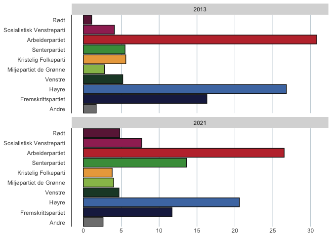

<!-- README.md is generated from README.Rmd. Please edit that file -->
<!-- Use `devtools::build_readme()` to build README.md -->

# valgdata

<!-- badges: start -->

[](https://github.com/emmaSkarstein/valgdata/actions/workflows/R-CMD-check.yaml)
<!-- badges: end -->

**English** \| This package contains datasets from the last few
parliamentary elections in Norway, as well as functions to visualise
these.

**Norsk** \| Denne pakken inneholder valgdata fra Stortingsvalgene fra
2013 og fram til i dag, og en rekke funksjoner for å visualisere disse.

## Installering

Du kan installere den seneste versjonen av {valgdata} fra
[GitHub](https://github.com/) med:

``` r
# install.packages("devtools")
devtools::install_github("emmaSkarstein/valgdata")
```

Deretter kan du laste inn pakken slik:

``` r
library(valgdata)
```

## Hvordan bruke pakken?

Pakken inneholder funksjoner som er beregnet for å plotte valgdataen.
For eksempel kan vi plotte valgoppslutningen i 2013 og 2021:

``` r
plot_valgoppslutning(c("2013", "2021"))
```



Det er også mulig å se på datasettene direkte:

``` r
mandater
#> # A tibble: 20 × 3
#>    parti                     aar   mandater
#>    <fct>                     <fct>    <int>
#>  1 Rødt                      2017         1
#>  2 Rødt                      2021         8
#>  3 Sosialistisk Venstreparti 2017        11
#>  4 Sosialistisk Venstreparti 2021        13
#>  5 Arbeiderpartiet           2017        49
#>  6 Arbeiderpartiet           2021        48
#>  7 Senterpartiet             2017        19
#>  8 Senterpartiet             2021        28
#>  9 Miljøpartiet de Grønne    2017         1
#> 10 Miljøpartiet de Grønne    2021         3
#> 11 Pasientfokus              2017         0
#> 12 Pasientfokus              2021         1
#> 13 Venstre                   2017         8
#> 14 Venstre                   2021         8
#> 15 Kristelig Folkeparti      2017         8
#> 16 Kristelig Folkeparti      2021         3
#> 17 Høyre                     2017        45
#> 18 Høyre                     2021        36
#> 19 Fremskrittspartiet        2017        27
#> 20 Fremskrittspartiet        2021        21
```

``` r
velgeroppslutning |> tidyr::pivot_wider(names_from = aar, values_from = prosent)
#> # A tibble: 10 × 4
#>    parti                     `2013` `2017` `2021`
#>    <fct>                      <dbl>  <dbl>  <dbl>
#>  1 Arbeiderpartiet             30.8   27.4   26.5
#>  2 Høyre                       26.8   25     20.6
#>  3 Fremskrittspartiet          16.3   15.2   11.7
#>  4 Senterpartiet                5.5   10.3   13.6
#>  5 Sosialistisk Venstreparti    4.1    6      7.7
#>  6 Venstre                      5.2    4.4    4.7
#>  7 Kristelig Folkeparti         5.6    4.2    3.8
#>  8 Miljøpartiet de Grønne       2.8    3.2    4  
#>  9 Rødt                         1.1    2.4    4.8
#> 10 Andre                        1.7    1.8    2.6
```

``` r
partifarger
#> # A tibble: 10 × 2
#>    farge   parti                    
#>    <chr>   <chr>                    
#>  1 #204631 Venstre                  
#>  2 #A12F63 Sosialistisk Venstreparti
#>  3 #479B49 Senterpartiet            
#>  4 #6B2145 Rødt                     
#>  5 #98BE59 Miljøpartiet de Grønne   
#>  6 #EBA84B Kristelig Folkeparti     
#>  7 #4D79B2 Høyre                    
#>  8 #1D244F Fremskrittspartiet       
#>  9 #C1353A Arbeiderpartiet          
#> 10 grey50  Andre
```
